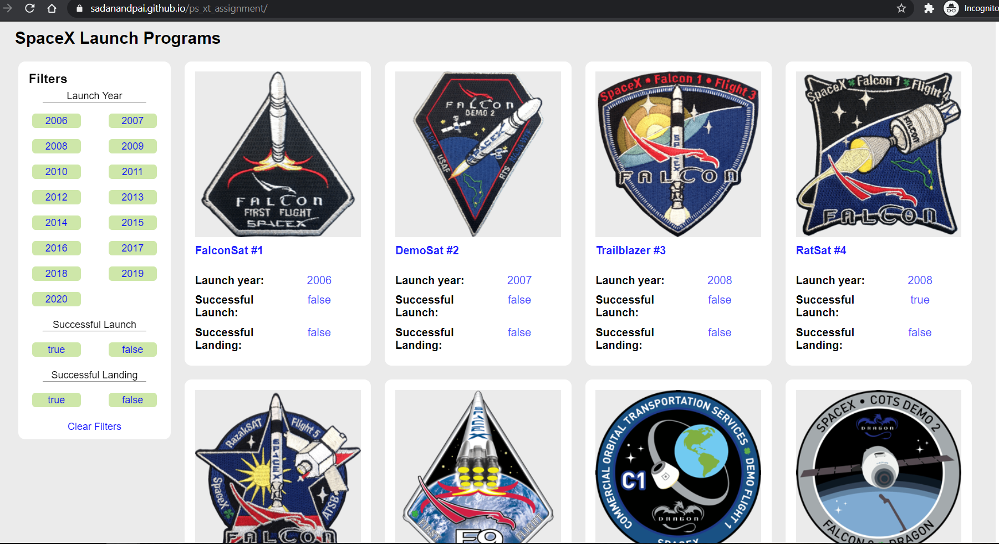
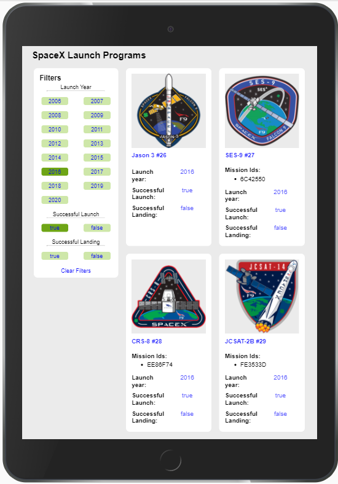
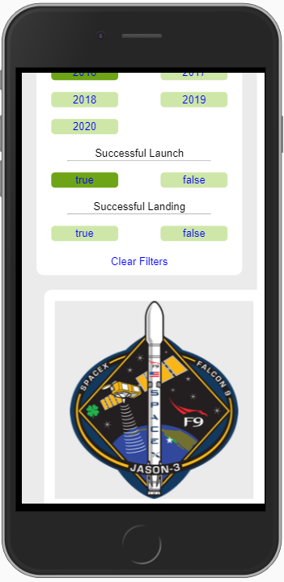
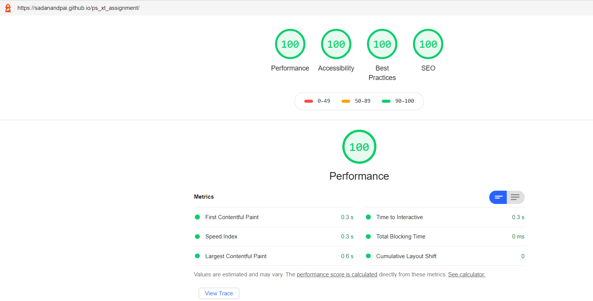
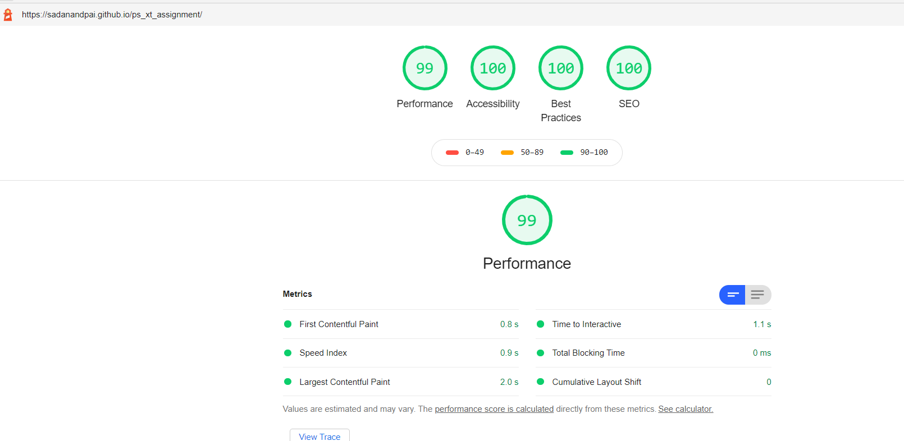

# ps-xt-assignment

    

## Stack
- HTML, CSS and JavaScript are used as the core technologies
- ReactJS is used to manage the DOM manipulations and data rendering
- React router is used to manage internal routing at user interface

## Design
- The web app is built considering mobile first approach with progressive enhancements
- The UI majorly divided in to 2 sections
  - Filter section
  - Mission data display section
- The UI is made responsive using media query as mentioned for Mobile View, Tablet View and Desktop View
- Multiple filters can applied by clicking on the filters
- Clear all filters will clear applied filters

    
    
    

## Technical Details
- The filter section designed using flex with 50% width for each filter items
- The Mission data display section is designed using flex and the items are wrapped to display in multiple lines
- The components are divided into 3 parts
  - Filter
  - Mission Data display
  - Mission card
- Loader is displayed when API response is awaiting
- No data is displayed to when no filtered items are present to be displayed
- Filters are reflected using query params in URL which works for refresh as well

## Performance
- Insustry standard best practices are followed
- Application is built considering the various factors to deliver high performance such as
- Images are loaded lazily
- Animations are done using CSS

    
    

## Build and Packaging
- Parcel is used to build and package the front end code
  - Run: `parcel ./source_code/index.html`
  - Build: `parcel build ./source_code/index.html`
